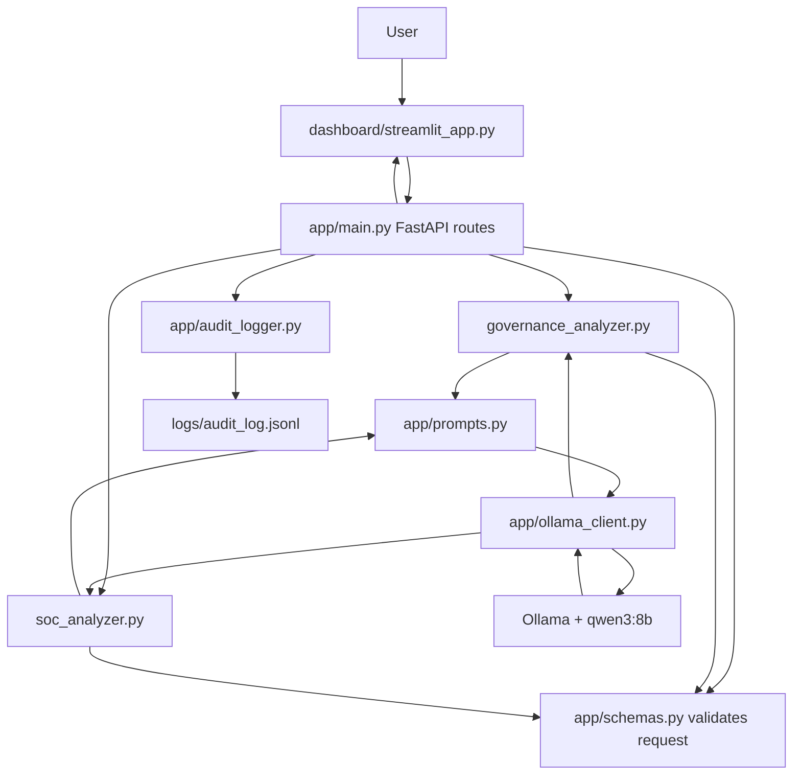
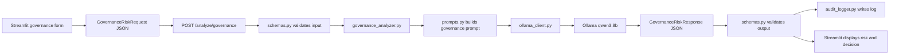
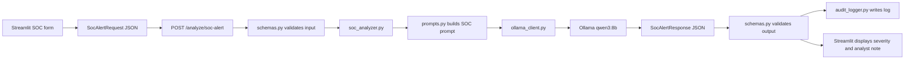
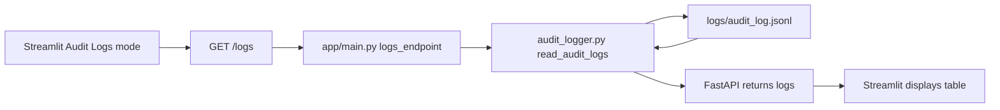

# Mermaid Versions of Project Flow Diagrams

## Overall Architecture

```mermaid
flowchart TD
    User[User] --> UI[dashboard/streamlit_app.py]
    UI --> Main[app/main.py FastAPI routes]
    Main --> Schemas[app/schemas.py validates request]
    Main --> Gov[governance_analyzer.py]
    Main --> SOC[soc_analyzer.py]
    Gov --> Prompts[app/prompts.py]
    SOC --> Prompts
    Prompts --> Client[app/ollama_client.py]
    Client --> Ollama[Ollama + qwen3:8b]
    Ollama --> Client
    Client --> Gov
    Client --> SOC
    Gov --> Schemas
    SOC --> Schemas
    Main --> Logs[app/audit_logger.py]
    Logs --> JSONL[logs/audit_log.jsonl]
    Main --> UI
```

## Governance Mode

```mermaid
flowchart LR
    UI[Streamlit governance form] --> Payload[GovernanceRiskRequest JSON]
    Payload --> Endpoint[POST /analyze/governance]
    Endpoint --> Schema[schemas.py validates input]
    Schema --> Analyzer[governance_analyzer.py]
    Analyzer --> Prompt[prompts.py builds governance prompt]
    Prompt --> Client[ollama_client.py]
    Client --> Model[Ollama qwen3:8b]
    Model --> Response[GovernanceRiskResponse JSON]
    Response --> Validate[schemas.py validates output]
    Validate --> Log[audit_logger.py writes log]
    Validate --> UIResult[Streamlit displays risk and decision]
```

## SOC Alert Mode

```mermaid
flowchart LR
    UI[Streamlit SOC form] --> Payload[SocAlertRequest JSON]
    Payload --> Endpoint[POST /analyze/soc-alert]
    Endpoint --> Schema[schemas.py validates input]
    Schema --> Analyzer[soc_analyzer.py]
    Analyzer --> Prompt[prompts.py builds SOC prompt]
    Prompt --> Client[ollama_client.py]
    Client --> Model[Ollama qwen3:8b]
    Model --> Response[SocAlertResponse JSON]
    Response --> Validate[schemas.py validates output]
    Validate --> Log[audit_logger.py writes log]
    Validate --> UIResult[Streamlit displays severity and analyst note]
```

## Audit Logs Mode

```mermaid
flowchart LR
    UI[Streamlit Audit Logs mode] --> LogsEndpoint[GET /logs]
    LogsEndpoint --> Main[app/main.py logs_endpoint]
    Main --> Logger[audit_logger.py read_audit_logs]
    Logger --> JSONL[logs/audit_log.jsonl]
    JSONL --> Logger
    Logger --> Response[FastAPI returns logs]
    Response --> Table[Streamlit displays table]
```
